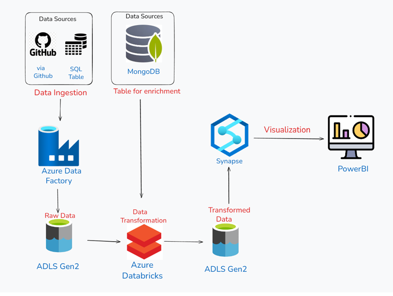

# End-to-End Azure Data Engineering Pipeline for E-commerce Analytics


## 📋 Project Overview

A production-grade **batch data engineering pipeline** built on Microsoft Azure, processing **100,000+ e-commerce transactions** from the Brazilian Olist dataset. The solution implements **Medallion Architecture** (Bronze → Silver → Gold) to transform raw multi-source data into actionable business intelligence.

---

## 🏗️ Architecture

The pipeline follows **Medallion Architecture** with three progressive data quality layers:

**Bronze** → Raw data ingestion from multiple sources  
**Silver** → Cleaned, validated & enriched datasets  
**Gold** → Business-ready aggregated analytics

### Pipeline Flow

`GitHub / MySQL / MongoDB` → **Azure Data Factory** → **ADLS Gen2 (Bronze)**  
↓  
**Azure Databricks (PySpark Transformations)** → **ADLS Gen2 (Silver)**  
↓  
**Azure Synapse Analytics (Serverless SQL + CETAS)** → **Gold Layer**  
↓  
**Power BI Dashboards**

  
*For detailed architecture, see `Docs/Architecture_Pipeline.png`*

---

## 🛠️ Technology Stack

| Component    | Technology                      | Purpose                                        |
|--------------|----------------------------------|------------------------------------------------|
| **Ingestion**| Azure Data Factory               | Metadata-driven multi-source ingestion        |
| **Storage**  | Azure Data Lake Gen2 (ADLS)      | Hierarchical data lake with Bronze/Silver/Gold layers |
| **Transformation** | Azure Databricks (PySpark) | Distributed data processing & enrichment      |
| **Serving**  | Azure Synapse Analytics          | Serverless SQL pool for lakehouse queries     |
| **Visualization** | Microsoft Power BI          | Executive & operational dashboards            |
| **Databases**| MySQL, MongoDB                   | Simulated enterprise data sources             |

---

## 📊 Dataset

**Source:** [Brazilian E-Commerce Public Dataset by Olist (Kaggle)](https://www.kaggle.com/datasets/olistbr/brazilian-ecommerce)

- **Size:** ~100,000 orders (2016–2018)  
- **Tables:** 8 interconnected CSVs (orders, customers, products, payments, sellers, reviews, geolocation)  
- **Simulation:** Data distributed across HTTP (GitHub), MySQL, and MongoDB to mirror real enterprise environments


---

## 📁 Repository Structure

```

BigData_Azure_cloud_project/
├── Docs/
│   ├── Architecture_Pipeline.png
│   ├── Data_Connection.png
│   └── Report_Big_Data_Azure_Project.pdf
├── PowerBI/
│   ├── PLots2.pbix
│   └── Screenshot1.png
│   └── Screenshot2.png
│   └── Screenshot3.png
│   └── Screenshot4.png
├── notebooks/
│   ├── DataIngestionToDB.ipynb
│   ├── Databricks_Tranformation_2.ipynb
│   └── JSONforeachinput.json
├── data/
│   └── [Links to Kaggle source]
└── README.md

```

---

## 🚀 Implementation Highlights

### 1️⃣ Metadata-Driven Ingestion (Bronze Layer)
- **Azure Data Factory** uses `Lookup` + `ForEach` activities to dynamically ingest from multiple sources.
- Centralized JSON configuration eliminates hardcoded pipelines.
- Supports HTTP (GitHub), MySQL, MongoDB with a unified Copy Activity pattern.

**Key File:** `notebooks/JSONforeachinput.json`

### 2️⃣ Distributed Transformation (Silver Layer)
**Azure Databricks** performs:
- Multi-table joins across 8 datasets using PySpark.
- Data enrichment from MongoDB (product category translations).
- Delivery time & delay calculations.
- Date conversions and duplicate removal.
- Output in **Parquet** format for optimal performance.

**Notebooks:**
- `notebooks/DataIngestionToDB.ipynb` — MySQL data loading
- `notebooks/Databricks_Tranformation_2.ipynb` — Bronze → Silver transformations

### 3️⃣ Lakehouse Serving (Gold Layer)
**Azure Synapse Analytics** provides:
- **Serverless SQL Pool** queries Parquet files directly from ADLS.
- **CETAS** (CREATE EXTERNAL TABLE AS SELECT) materializes curated tables.
- No data movement — true lakehouse abstraction.
- Power BI connects via DirectQuery.

---

## 📈 Business Insights & KPIs

### Executive Dashboard


**Key Metrics:**
- **Total Revenue:** R$ 15.4M  
- **Orders:** 99,441  
- **On-Time Delivery:** 93.91%  
- **Average Order Value:** R$ 154

### Operational Analytics


**Insights:**
- **Geographic Concentration:** São Paulo accounts for R$ 1.3B (~84% of revenue)  
- **Payment Methods:** Credit cards dominate (73% of transactions)  
- **Product Optimization:** Listings with 3–5 photos achieve 28% higher conversion  
- **Freight Analysis:** Price-freight correlation identifies cost reduction opportunities

### Delivery Performance


**Findings:**
- 93.91% orders delivered on/before estimated date  
- Average delivery time: 12 days  
- Late deliveries concentrated in remote regions (North/Northeast Brazil)

---

## 🔐 Security & Best Practices

- **Service Principal** authentication for Databricks ↔ ADLS  
- **Managed Identity** for Synapse ↔ ADLS  
- **Role-Based Access Control (RBAC)** across resources  
- **Complete data lineage** (Bronze → Silver → Gold)  
- **Immutable Bronze layer** for auditability  
- **Parquet columnar storage** for performance  
- **Serverless architecture** for cost optimization

---

## 💡 Key Learnings & Skills Demonstrated

### Data Engineering
- Medallion Architecture implementation  
- Metadata-driven ETL pipelines  
- Multi-source data integration (SQL, NoSQL, HTTP)  
- Distributed data processing with PySpark  
- Lakehouse architecture (Synapse Serverless)

### Azure Services
- Azure Data Factory (ADF)  
- Azure Data Lake Storage Gen2 (ADLS)  
- Azure Databricks  
- Azure Synapse Analytics  
- Power BI integration

### Technical Skills
- Python, PySpark, SQL  
- Data modeling & schema design  
- Cloud security (RBAC, Service Principals, Managed Identities)  
- Performance optimization (Parquet, partitioning, caching)  
- CI/CD for data pipelines

---

## 📄 Documentation

- **Full Project Report:** `Docs/Report_Big_Data_Azure_Project.pdf` — 16-page technical documentation  
- **Architecture Diagram:** `Docs/Architecture_Pipeline.png` — End-to-end flow visualization  
- **Data Model:** `Docs/Data_Connection.png` — Entity relationship diagram

---

## 🎓 About This Project

This project was developed as part of a **Big Data Engineering Course Project** to demonstrate enterprise-grade data engineering skills on Azure. It showcases real-world scenarios including:
- Multi-source heterogeneous data integration  
- Scalable cloud-native architecture  
- Production-ready security & governance  
- Business value generation through analytics

---

## 🔗 Connect

**Author:** Rashi Niyas P  
**Project Type:** Data Engineering course project  
**Tech Stack:** Azure, Databricks, PySpark, Synapse, Power BI

---

## 📝 License

This project uses the **Brazilian E-Commerce Public Dataset by Olist** from Kaggle (CC BY-NC-SA 4.0).  
Project code and documentation: **MIT License**

---

⭐ **If you find this project helpful, please consider giving it a star!**
```

